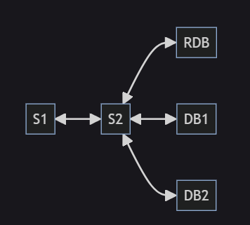
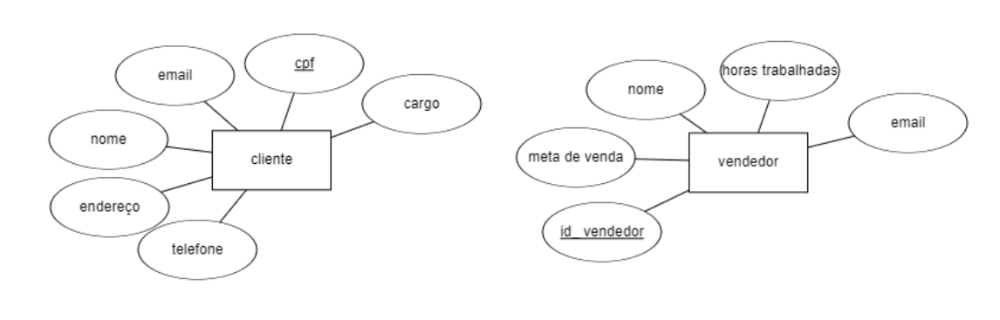
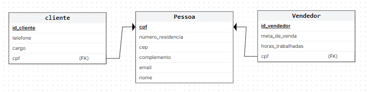
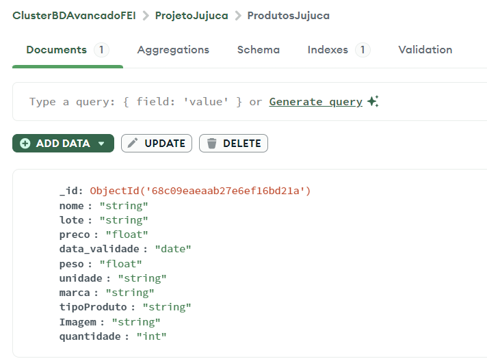
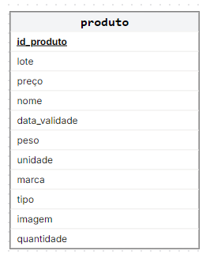
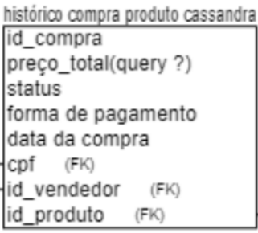

# Gerenciamento Jujuca Bombonier 

Integrantes: 
-Beatriz Manaia Lourenço Berto  
-Rafael Dias Silva Costa 
-Kayky Pires de Paula

## Estrutura do Projeto:

-S1: 
É serviço de front-end de HTML e CSS que deve fazer requisições ao serviço S2. Estas requisições podem conter tanto dados fictícios que serão armazenados no bancos como requisições de dados que estão nos bancos e que devem ser retornadas. Os dados fictícios gerados devem ser de pelo menos 3 tipos diferentes, sendo que cada um deles será armazenado em um banco diferente. O serviço S1 deve armazenar todos as respostas de  S2 junto com as requisições realizadas para verificação do funcionamento de S1.
-retorno pro front: retorna json pro front usando spring.

## Tema:

Esse projeto tem como intuito fornecer uma organização do comércio da doceria Jujuca Bombonier da FEI, bem como facilitar o controle de vendas e lucros do local.

## Como Serviço 2 será implementado:

S2 será implementado para CRUD dos bancos, inserção e busca de dados de acordo com o que cada banco é responsável por armazenar. 

Assim, será dividido em 3 serviços, um para cada banco de dados. O primeiro, crud cliente e do vendedor (dados do banco de dados relacional), um para CRUD produto (banco de dados nao relacional, mongoDB) e uma para CRUD da compra (banco de dados nao relacionao Cassandra).

-linguagens utilizadas para comunicar com cada banco de dados:
    BD1 Supabase(PostGree): Java + Springboot 
    BD2 MongoDB: Java   ->olhar classe record!!!
    BD3 Cassandra: Java

## Bancos de dados:
 
 ### (RDB) Banco de dados Relacional (SQL): Supabase (PostgreeSQL)
 Escolhemos guardar em um banco de dados relacional as informações referentes aos clientes e vendedores, afinal são dados bem estruturados que possuem relacionamentos entre si e tem várias características semelhantes. 
 Já a escolha do Supabase(Postgree) dentre todas as opções de bancos relacionais devido ao conhecimento básico que possuímos desse banco e a maior facilitar de 3 integrantes do grupo utilizarem ele do queo proprio PostgreSQL.

 #### Dados armazenados e como armazenar:

 ##### Modelo Entidade Relacionamento:

 
 
  CEP/NUMERO
 pessoa (mesma pessoa pode vender e comprar)

 ##### Modelo Relacionar 3 Forma Normal:

   

 ### (DB1) Banco de dados 2 Não Relacional (NoSQL): MongoDB

Esse banco de dados foi escolhido para armazenar informações dos produtos pois da a possibilidade de cada produto ter sua propria estrutura

E escolhemos o MongoDb dentro de todas as opções de bancos não relacionais devido ao conhecimento prévio que possuímos.

 #### Dados armazenados e como armazenar:  AJUSTAR COM PRINT DO MONGO  

 

 {"_id": "ObjectId", "nome": string, 'valor":foat}...
 *mongo fala estrutura e armazeno um dado ele se vira, mas posso definir tipo dele do lado

 

 ### (DB2) Banco de dados 3 Não Relacional (NoSQL): Cassandra
 
 Escolhemos esse banco para armazenar histórico de compra da loja e do histórico de estoque dos produtos, pois o Cassnadra é muito bom para essa finalidade.

  #### Dados armazenados e como armazenar:   JÁ FAZER NO CASSANDRA??
  -Só a tabela, sem a relação: colocar chave de 
  agrupamento e de parcelamento
  -chave particp user -> so mostra pro usero dele, chave de agrup oq ela compro

  
 -produto = array id de produto
 cliente é chave de parcelamento

  (print disso dentro do cassandra)

## Como desenvolvemos esse projeto:

1-Criar projeto de SpringBoot no Spring Initializer 

Utilizaremos o spring Initializer pois ele:

  -Gera a estrutura correta de pastas e arquivos necesários para o projeto. 
  -Configura automaticamente o pom.xml (arquivo de configuração central do Maven, que é uma ferramenta de automação de build e gerenciamento de dependências para projetos Java) 
  -Adiciona as dependências necessárias do SpringBoot.

  a)acessamos esse link: https://start.spring.io/

  b)Configuramos o projeto maven e dependências
  (escolhemos o maven pois é mais facil para quem tem pouca experiência com o spring boot)

  c)baixamos o zip, descompactamos e colocamos na pasta desse repositório

## Como executar o projeto

### Serviços e recursos utilizados:

#### configurar bancos de dados que serão utilizados:

a)Cassanda (para windows)
	-Criar conta nesse link: https://astra.datastax.com/org/b967d83c-1d32-4c30-a883-d418dd8a576c/database
    -criar um projeto e adicionar integrantes do seu projeto no setting->users com o email que eles usaram prsa criar a conta
    -Segui passo a passo para conectar no projeto https://astra.datastax.com/org/0002c76a-72f4-4ad7-bae8-9e400dc8af64/database/ca82aef8-88f6-43d3-a70f-3458e95f15ec/connect
	-instalar o maven e colocar a variavel de ambiente com o caminho do download
	
	
    -em "select a method"escolha "drivers" e "type native"

b)MongoDB 
-crie uma conta nesse link: https://www.mongodb.com/cloud/atlas/register 

c)Supabase(PostGreeSQL)
-Abrir o link: https://supabase.com/dashboard/new/wawxvgvnefwlhzkrdnfz
-Criams um projeto com nome: Projetojujuca
-No SQL Editor coloque esse codigo para criar as tabelas:

-Criação manual das tabelas que serão utilizadas nos bancos:

a) Cassandra
    -Criar database com nome: ProjetoJujucaCassandra
    -Inserção de dados será conforme usuario interage com a aplicacao (e script?????)
    -um integrante do grupo criou o projeto e adicionou os outros como colaboradores

b) MongoDB
    -crie um cluster 
    -no lado esquerdo, clique em  “Projeto overview” e onde aparecer “cluster” clique em “browser collections”
    -dentro do seu cluster, crie um database para o projeto 
        -Database name: ProjetoJujucaMongo
        -Collection Name: ProdutosJujuca
    (é nessa coleção que será realizado o CRUD dos produtos, por isso é preciso deixar as collections vazias pois os dados serõ inseridos
    -um integrante do grupo criou o projeto e adicionou os outros como colaboradores

    *CRIO COlECAO vazia, sem estruturae quando crio codigo pra jogar dados pra la, verifico tipo dos dados
    (conforme usuario interage na apicacao e script???)

c) Supabase
    -Como usaremos springboot, ele criará as tabelas para nós, basta criar o projeto com o nome "Projetojujuca"
    -um integrante do grupo criou o projeto e adicionou os outros como colaboradores

### Como rodar:

Rodaremos o front-end e o back-end de maneira local. Já para os bancos de dados, utilizaremos DBSaaS (Database as a service), para banco de dados relacional, usaremos PostgreSQL no Supabase, para os banco de dados não sequenciais, utilizarems Cassandra no Datastax e MongoDB no Atlas.

