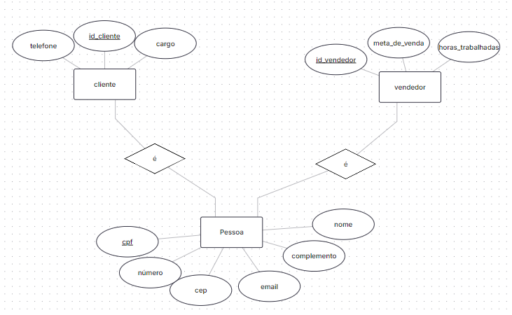

# Gerenciamento Jujuca Bombonier 

Integrantes: 
-Beatriz Manaia Lourenço Berto  
-Rafael Dias Silva Costa 
-Kayky Pires de Paula

## Estrutura do Projeto:

-S1: 
É serviço de front-end de HTML e CSS que deve fazer requisições ao serviço S2. Estas requisições podem conter tanto dados fictícios que serão armazenados no bancos como requisições de dados que estão nos bancos e que devem ser retornadas. Os dados fictícios gerados devem ser de pelo menos 3 tipos diferentes, sendo que cada um deles será armazenado em um banco diferente. O serviço S1 deve armazenar todos as respostas de 

## Tema:

Esse projeto tem como intuito fornecer uma organização do comércio da doceria Jujuca Bombonier da FEI, bem como facilitar o controle de vendas e lucros do local.

## Como Serviço 2 será implementado:

S2 será implementado para CRUD dos bancos, inserção e busca de dados de acordo com o que cada banco é responsável por armazenar. Assim, será dividido em 3 serviços: um para crud cliente e do vendedor (dados do banco de dados relacional), um para CRUD produto e uma para CRUD da compra.
Ele gera requisições sobre CRUD de clientes, vendedores e produtos, além da compra de produtos por clientes.

-linguagens utilizadas para comunicar com cada banco de dados:
    BD1 Supabase(PostGree): Java  
    BD2 MongoDB: Java  
    BD3 Cassandra: Java

## Bancos de dados:
 
 ### (RDB) Banco de dados Relacional (SQL): Supabase (PostgreeSQL)
 Escolhemos esse banco de dados para guardar todas as informações referentes aos clientes e vendedores, afinal são dados bem estruturados e com várias características semelhantes, o Postgree também foi escolhido dentre todas as opções de bancos relacionais devido ao conhecimento básico que possuímos desse banco.

 #### Modelo Entidade Relacionamento:

 

 ### (DB1) Banco de dados 2 Não Relacional (NoSQL): MongoDB

 Esse banco de dados foi escolhido para armazenar informações dos produtos, escolhemos esse banco devido ao conhecimento prévio que possuímos.

 ### (DB2) Banco de dados 3 Não Relacional (NoSQL): Cassandra
 Escolhemos esse banco para armazenar histórico de compra da loja e do histórico de estoque dos produtos, escolhemos esse banco pois ele é muito bom para isso.

## Como executar o projeto

### Serviços e recursos utilizados:

1-configurar bancos de dados que serão utilizados:

a)Cassanda (para windows)
	-Criar conta nesse link: https://astra.datastax.com/org/b967d83c-1d32-4c30-a883-d418dd8a576c/database
	-Criar database com nome: ProjetoJujucaCassandra

b)MongoDB 
- crie uma conta nesse link: https://www.mongodb.com/cloud/atlas/register e crie um cluster 
- no lado esquerdo, clique em  “Projeto overview” e onde aparecer “cluster” clique em “browser collections”
-dentro do seu cluster, crie um database para o projeto 
    -Database name: ProjetoJujucaMongo
    -Collection Name: ProdutosJujuca
(é nessa coleção que será realizado o CRUD dos produtos)

c)Supabase(PostGreeSQL)
