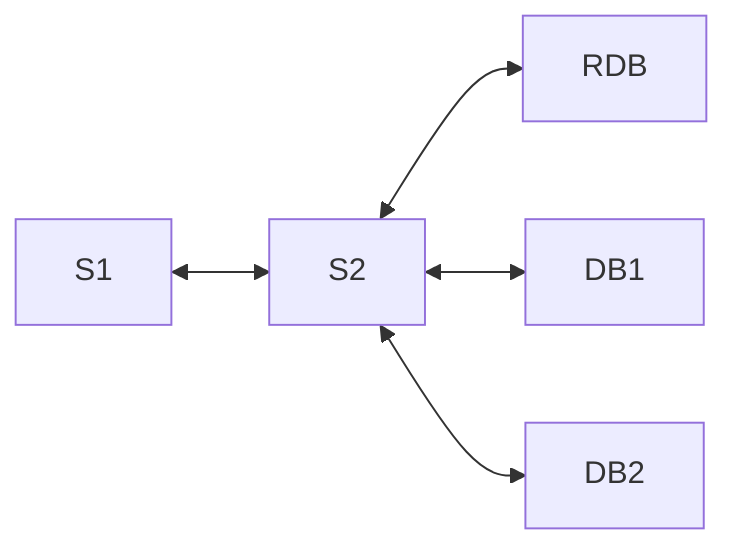
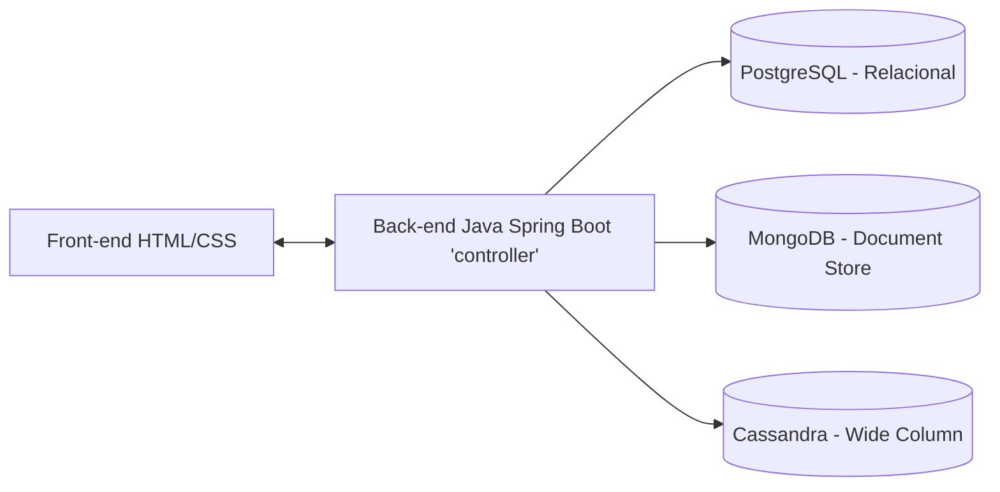

# 🍬 Gerenciamento Jujuca Bombonier

## Integrantes
- Beatriz Manaia Lourenço Berto
- Rafael Dias Silva Costa
- Kayky Pires de Paula

---

## 📘 Descrição do Projeto



O projeto **Gerenciamento Jujuca Bombonier** tem como objetivo desenvolver um sistema que facilite o controle de vendas, estoque e lucros da doceria Jujuca Bombonier, localizada na FEI.  
A proposta é utilizar três bancos de dados diferentes (um relacional e dois não relacionais), com base na natureza dos dados e na necessidade de cada operação.

O sistema é dividido em dois serviços principais:
- **S1 (Front-end):** interface desenvolvida em HTML/CSS, responsável por enviar requisições ao serviço S2 e exibir as respostas em formato JSON.
- **S2 (Back-end):** desenvolvido em Java com Spring Boot, responsável por realizar o CRUD de cada tipo de dado e gerenciar a comunicação com os três bancos.
- **RDB (Relacional):** escolhido Supabase.
- **DB1 e DB2:** escolhido MongoDB e Cassandra.


---

## 🗂 Estrutura Geral



---

## ⚙️ Tecnologias Utilizadas

- Java 17
- Spring Boot
- HTML / CSS
- Maven
- Supabase (PostgreSQL)
- MongoDB Atlas
- Cassandra Astra DB (Datastax)

---

## 💾 Bancos de Dados

### 1. Supabase (PostgreSQL) – Relacional

- Utilizado para armazenar **clientes e vendedores**, pois são dados estruturados e com relacionamentos bem definidos.
- Optamos pelo Supabase pela facilidade de uso e integração entre os membros do grupo.

**Exemplo de entidades:**
- Cliente(id, nome, cpf, telefone, cep, numero)
- Vendedor(id, nome, cpf, telefone, cep, numero)


---

### 2. MongoDB Atlas – Não Relacional (Document Store)

- Utilizado para armazenar **produtos** da doceria, já que cada produto pode conter atributos próprios e estrutura flexível.

**Exemplo de documento:**
```
{
  "_id": "ObjectId",
  "nome": "Trufa de chocolate",
  "valor": 4.50,
  "descricao": "Trufa artesanal recheada"
}
```


---

### 3. Cassandra Astra DB – Não Relacional (Wide Column)

- Utilizado para armazenar o **histórico de vendas** e **controle de estoque**.
- O Cassandra é ideal para dados que crescem rapidamente e precisam de alta performance de leitura/escrita distribuída.

**Exemplo de estrutura:**
- cliente_id, data_compra, produtos, valor_total


---

## 🧠 Como Desenvolvemos

- Criamos o projeto com o [Spring Initializr](https://start.spring.io/)
- Dependências adicionadas: Spring Web, Spring Data, PostgreSQL Driver, Cassandra, MongoDB.
- Estruturamos o back-end com controllers, models e repositories em Java.
- O S1 (HTML + CSS) envia requisições ao S2 via endpoints REST (Spring Controller).
- O S2 conecta-se aos três bancos simultaneamente, aplicando o CRUD de cada entidade no banco correspondente.

---

## 🚀 Tutorial de Execução

### 1. Pré-requisitos

- Conta ativa nos três bancos:
  - [Supabase](https://supabase.com/)
  - [MongoDB Atlas](https://www.mongodb.com/cloud/atlas/register)
  - [Cassandra Astra DB](https://astra.datastax.com/)
- Java 17 instalado e configurado como `JAVA_HOME`
- Maven instalado e adicionado às variáveis de ambiente

---

### 2. Clonar o Repositório

No Codespaces ou terminal local, execute:
```
git clone https://github.com/beatrizmanaia26/GerenciamentoJujuca_BD2.git
cd GerenciamentoJujuca_BD2
```

---

### 3. Configurar os Bancos

#### Supabase (PostgreSQL)
- Passo 1 - Criar um novo projeto chamado `ProjetoJujuca`<br>
  - Cliquem em **New Project** <br>
  <br>
  - Preencha os campos com os dados solicitados (Obs. Armazene a senha criada, pois será utilizada posteriormente)<br>
  <br>  
- Passo 2 - Obtendo JDBC para conexão com o banco de dados <br>
    - Clique em **Connect**<br>
    <br>
    - Em **type** coloque a opção **JDBC** e em **Method** selecione a opção **Session Pooler** <br>
    <br>
    - Copie a URL gerada.<br>
- Passo 3 - Configurando a **application.properties** com a conexão do banco<br>
    - Abra o arquivo **application.properties** <br>
      <br>
    - Cole a URL no campo demarcado<br>
      <br>
    - Troque pela senha criada no inicio da criação do banco de dados (Senha criada no passo 1)<br>
      <br><br>
**Banco de dados Supabase configurado!**<br>

#### MongoDB
- Criar um cluster com:
  - **Database:** ProjetoJujucaMongo
  - **Collection:** ProdutosJujuca
- Adicionar o usuário e senha no `application.properties`.

#### Cassandra
- Criar o database `ProjetoJujucaCassandra`
- Baixar o *secure connect bundle* e o token de acesso
- Adicionar o caminho e credenciais no arquivo `cassandraConfig.java`

---

### 4. Compilar e Executar

Caso tenha conseguido clonar tudo certo, apenas execute o arquivo java:

```managementsystem/src/test/java/com/project/jujucabomboniermanegementsystem/managementsystem/ManagementsystemApplicationTests.java```

caso de erro no MVN, instale-o com os seguintes comandos:
<br>
No terminal, execute:
`mvn package
java -jar target/managementsystem-0.0.1-SNAPSHOT.jar`

ou se estiver no VSCode:
`mvn spring-boot:run`


---

### 5. Como acessar e usar a aplicação

O sistema é executado localmente e, por padrão, estará disponível em:
👉 [http://localhost:8080](http://localhost:8080/)

Se estiver utilizando Codespaces do GitHub, será gerado um link público na plataforma com as portas 8080 ou 8081. O endereço aparece no início da execução do servidor.

#### Funcionalidades disponíveis na interface

- **Login do Funcionário**
  - É necessário realizar o login para acessar as funcionalidades do sistema.
  - Caso não haja funcionário cadastrado, utilize as credenciais padrão:
    - Usuário: `admin`
    - Senha: `FEI`
  - Após o login, todos os menus do sistema serão exibidos.

- **Gestão de Clientes e Funcionários**
  - Cadastrar novos clientes ou funcionários
  - Excluir e consultar registros de clientes e funcionários
  - Editar algumas informações dos clientes e funcionários

- **Gestão de Produtos**
  - Inserir novos produtos à doceria
  - Remover produtos existentes
  - Listar todos os produtos cadastrados
  - Editar quantidade, preço, lote, nome

- **Vendas e Estoque**
  - Registrar novas vendas
  - Visualizar o histórico de vendas realizadas
  - Consultar e gerenciar o estoque de produtos

---

## 🧩 Justificativa Técnica

A escolha pela por vários bancos, permite que cada tipo de dado seja tratado pelo banco mais adequado:
- **Relacional (Supabase/PostgreSQL):** garante integridade e normalização dos dados de pessoas.
- **Document Store (MongoDB):** oferece flexibilidade para produtos variados.
- **Wide Column (Cassandra):** otimiza o desempenho de registros históricos e consultas rápidas.

---

## 🧑‍💻 Conclusão

O projeto “Gerenciamento Jujuca Bombonier” demonstra como diferentes modelos de banco de dados podem coexistir de forma integrada em uma aplicação moderna.  
Através do uso do Spring Boot, foi possível abstrair grande parte da complexidade de conexão e permitir uma arquitetura limpa, escalável e didática para fins acadêmicos.


  
